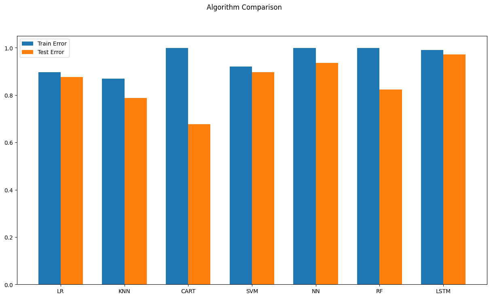
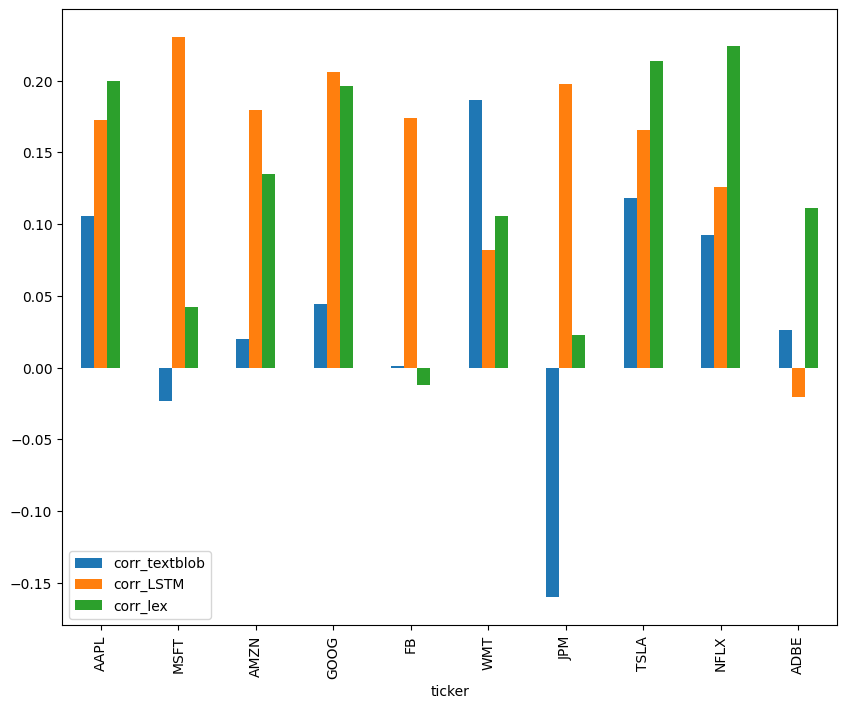
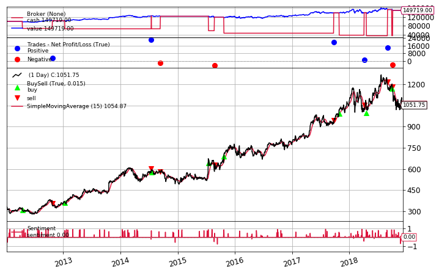

# 📈 NLP & Sentiment Analysis Based Trading Strategies

> **Can the tone of financial news be turned into a trading signal?**

This project explores that question by combining **Natural Language Processing, sentiment analysis, machine learning, and quantitative trading**.

The idea is simple: financial headlines contain information about how the market perceives a company. The project investigates whether that information can be extracted from text, connected to stock returns, and ultimately used to make trading decisions.

---

## 🔎 What I Explored

The project works with **82,643 financial news headlines** collected from RSS feeds between **2011 and 2018**, combined with market data for:

`AAPL` · `MSFT` · `AMZN` · `GOOG` · `FB` · `WMT` · `JPM` · `TSLA` · `NFLX` · `ADBE`

I explored three different approaches to measuring sentiment:

* **TextBlob** — general-purpose sentiment scoring
* **LSTM** — deep learning for headline sentiment classification
* **Financial Lexicon + VADER** — sentiment using finance-specific vocabulary

The goal was not just to classify headlines, but to investigate whether these sentiment signals had a relationship with **subsequent stock returns**.

---

## 🧠 Sentiment Classification

For the supervised sentiment task, several models were compared:

* Logistic Regression
* KNN
* Decision Tree
* SVM
* Random Forest
* Neural Network
* **LSTM**

The Neural Network achieved **93.6% test accuracy**, while the LSTM achieved **97.2% test accuracy**.

The LSTM was then used to generate sentiment scores for the financial headlines.

<p align="center">
  
</p>

---

## 📊 Does Sentiment Relate to Returns?

After generating sentiment scores, I compared them with stock event returns across the selected companies.

The analysis showed that the relationship varied depending on both the **sentiment method** and the **stock**.

For example, the correlation between LSTM sentiment and event returns was approximately **0.13** across the combined data, while the finance-oriented lexicon approach produced a correlation of approximately **0.10**.

<p align="center">
  
</p>

This highlights an important part of the project: **high sentiment-classification accuracy does not automatically mean strong predictive power for stock returns.**

---

## 💹 From Headlines to Trades

The final step was turning sentiment into an actual trading strategy.

The strategy uses **financial-lexicon sentiment** and generates trades when sentiment changes significantly:

**BUY**

* Sentiment increases by at least `0.5`
* Stock price is above its 15-day moving average

**SELL**

* Sentiment decreases by at least `0.5`
* Stock price is below its 15-day moving average

Trades were executed in fixed units of **100 shares** and backtested using **Backtrader**.

---

## 🚀 Backtest: GOOG

As an example, the strategy was backtested on **Google (GOOG)** from 2012–2018 with an initial portfolio of **$100,000**.

|                    |       Result |
| ------------------ | -----------: |
| Starting Portfolio |     $100,000 |
| Final Portfolio    | **$149,719** |
| Profit             |  **$49,719** |

<p align="center">
  
</p>

The backtest demonstrates how an NLP signal can move beyond classification and become part of a complete **text → signal → trade → portfolio** pipeline.

---

## 🛠️ Built With

**Python · Pandas · NumPy · Scikit-learn · Keras · TensorFlow · spaCy · TextBlob · VADER · yFinance · Backtrader · Matplotlib · Seaborn**

---

## 📂 Project Structure

```text
NLP-and-Sentiment-Analysis-Based-Trading-Strategies/
│
├── images/
│   ├── model_comparison.png
│   ├── sentiment_returns.png
│   └── backtest.png
│
├── NLP_and_Sentiment_Analysis–Based_Trading_Strategies.ipynb
├── README.md
└── requirements.txt
```

## 💡 The Bigger Question

The interesting part of this project isn't simply whether an NLP model can classify a headline correctly.

It's whether **understanding financial language can provide information that is useful in a market where that information is already being priced in.**

This project was an exploration of that problem — from raw financial headlines all the way to a backtested trading strategy.
